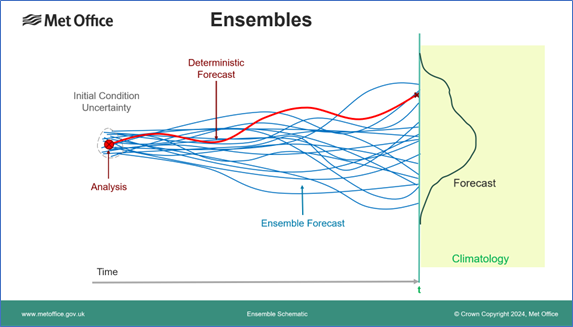

`Mina Naseh`, `Hesam Korki`

# **Ensemble Forecasting**

Ensemble forecasting is a technique that predicts outcomes by combining multiple models with slightly varied initial conditions or configurations. This approach accounts for uncertainties and chaos inherent in systems like weather predictions.

The diagram demonstrates how small variations at the start (left) can lead to diverse outcomes due to the chaotic nature of systems like weather (the butterfly effect). By running multiple forecasts, we generate a "spread" of possible outcomes, showcasing their likelihoods. The widening spread represents increasing uncertainty over time.

## **Overview and Goals**

This project implements ensemble forecasting in a High-Performance Computing (HPC) environment using parallelism with MPI. By combining predictions from thousands of forecasters, we aim to:
- Develop a modular and scalable framework for training forecasters in parallel.
- Aggregate predictions and compute statistical insights like mean, standard deviation, and quantiles.
- Visualize uncertainty bounds and key metrics to communicate the results effectively.
- Highlight the advantages of HPC for large-scale ensemble models.

---

## **Configuration**

The `config.py` file contains key settings and initialization values:
- **Parameters**:
  - `num_forecasters`: Number of forecasters in the ensemble (default: 5000).
  - `noise_std`: Standard deviation for perturbing initial weights.
  - `num_epochs`: Number of training epochs.
  - `horizon`: Prediction horizon (number of time steps).
- **Dataset**:
  - `X`: Input data for training.
  - `y`: Expected output.
- **Weights and Biases**:
  - `W` and `b`: Initial weights and biases of forecasters.

---

## **Forecaster Module**

The `forecaster.py` module defines key functionalities:
1. **Forecasting**:
   - `forecast_1step`: Predicts the next step using weights and biases.
   - `forecast`: Iteratively predicts over a specified horizon.
2. **Loss Computation**:
   - `forecast_1step_with_loss`: Calculates the squared error for a single-step prediction.
3. **Training**:
   - `training_loop`: Updates weights and biases iteratively to minimize prediction error using gradients.

## **Ensemble Module**

The `ensemble.py` module manages the creation, training, and evaluation of the ensemble. Key features include:

### **1. Ensemble Creation**
- Generates diverse forecasters by adding Gaussian noise to initial weights and biases.
- Enhances robustness by introducing variations in forecaster behavior.

### **2. Parallel Training with MPI**
- Forecasters are distributed across MPI ranks for training.
- Each rank handles a subset of forecasters, reducing computational time.
- Trained models are gathered at the root rank for aggregation.

### **3. Prediction Aggregation**
- Predictions for a specified horizon are generated in parallel.
- The root rank aggregates these predictions for statistical analysis.

### **4. Statistics Export**
- Exports detailed statistics, including:
  - Mean and standard deviation of predictions.
  - Percentiles (e.g., 5th, 50th, 95th).
  - Training loss metrics over epochs.
- Saves outputs in CSV format for further analysis.

## **Main Script**

The `main.py` script orchestrates the overall process:

### **Key Steps**
1. **Initialization**:
   - Sets up the MPI environment for parallel processing.
   - Configures ensemble parameters and input data.
2. **Ensemble Creation**:
   - The root rank creates an ensemble and broadcasts it to all ranks.
3. **Parallel Training**:
   - Each rank trains its allocated forecasters and gathers the results.
4. **Prediction Aggregation**:
   - Forecasts are computed in parallel and gathered at the root rank.
5. **Visualization and Statistics**:
   - Generates key visualizations:
     - Random forecaster trajectories.
     - Prediction uncertainty bounds.
     - Quantile plots (e.g., 5th-95th percentiles).
     - Training loss history.
   - Saves results and statistics in organized files.

## **Parallelization Approach**

The project leverages MPI to parallelize computation:
1. **Training**:
   - Distributes forecasters across ranks for local training.
   - Each rank handles parameter updates independently.
2. **Prediction**:
   - Forecasts are generated locally and aggregated at the root.
3. **Scalability**:
   - Dynamic distribution of forecasters ensures efficient utilization of resources, enabling the handling of thousands of forecasters.

### **Advantages of Parallelization**
- **Efficiency**: Accelerates training and prediction for large ensembles.
- **Scalability**: Easily scales with available processors.
- **Reproducibility**: Ensures deterministic results across runs.

## **Results and Outputs**

- **`plots folder`**:
  - Random forecaster trajectories.
  - Uncertainty bounds showing variability in predictions.
  - Quantile plots for analyzing prediction ranges.
  - Training loss history.
- **`stats folder`**:
  - CSV files with detailed prediction metrics (mean, standard deviation, percentiles).
  - Loss statistics (mean, min, max, standard deviation).

## **Conclusion**

This project demonstrates the power of ensemble forecasting enhanced by HPC. By efficiently managing thousands of forecasters, we achieve robust predictions, meaningful statistical insights, and scalable performance. The approach is not only relevant for time-series forecasting but also adaptable to other domains requiring ensemble learning.
